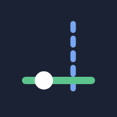
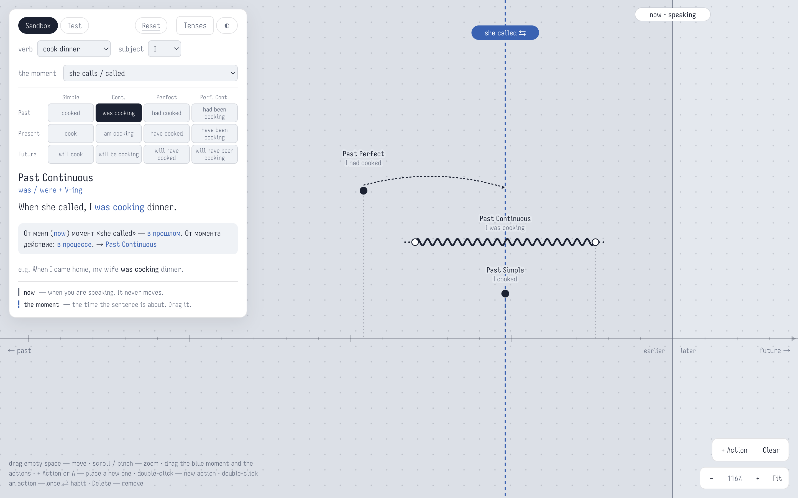
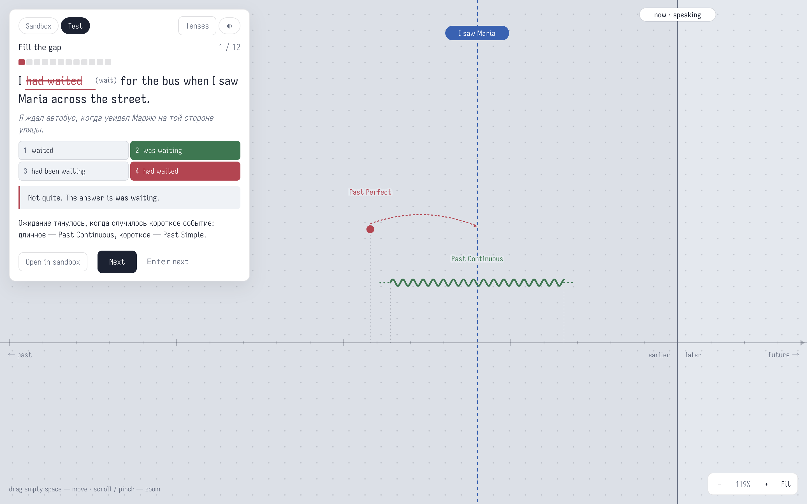
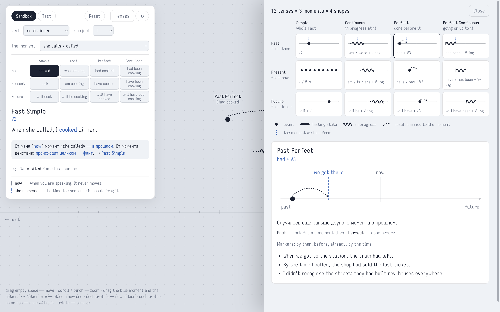

<p align="center">
  
</p>

<h1 align="center">English Tenses</h1>

<p align="center">
  <strong>Drag a moment. Drag an action. Watch the tense read itself off the picture.</strong>
</p>

<p align="center">
  A free trainer for the English tense system, with Russian explanations.<br />
  An infinite timeline sandbox, a 12-question test, and a reference sheet of all 13 tenses.
</p>

<p align="center">
  <a href="https://bmox0.github.io/EnglishTenses/">Open the app</a> ·
  <a href="#how-the-tense-is-read-from-the-picture">How it works</a> ·
  <a href="#adding-sentences">Add sentences</a> ·
  <a href="#development">Development</a>
</p>

<p align="center">
  <a href="https://github.com/bmox0/EnglishTenses/actions/workflows/deploy.yml">
    
  </a>
  
  
</p>



## Features

### Sandbox: an infinite timeline

Pick a verb, a subject and a reference moment from three selects — there's no free text. Drag the blue dashed **moment** and any **action** anywhere on the timeline; the tense recomputes live from where they sit, with no canonical drawing to match.

| What you get                  | How it works                                                                                                                                                                              |
| ----------------------------- | ----------------------------------------------------------------------------------------------------------------------------------------------------------------------------------------- |
| **A live picture**            | Drag the moment or an action; the panel names the tense the picture reads as, an example sentence for it, and a Russian chain of reasoning                                                |
| **A mini 3×4 table**          | Click a cell to morph the selected action straight into that tense's picture — the panel names the target tense from the first frame to the last, with nothing flickering past on the way |
| **A worked example**          | The chosen verb, subject and moment build a live example sentence, e.g. `Right now I `**`am cooking`**` dinner.`                                                                          |
| **A Russian reasoning chain** | `От меня (now) момент «she called» — в прошлом. От момента действие: уже сделано. → Past Perfect`                                                                                         |
| **Add your own action**       | `+ Action` (or `A`), then click the timeline; double-click turns a point into a repeated habit (a row of dots) and back                                                                   |
| **The Tenses sheet**          | All 12 grid tenses as small pictures with their formula; click one for the big picture, the Russian gloss, the markers and up to 3 bank sentences                                         |

### Test: 12 questions, two shapes

Every test mixes two question types at random, never asks the same tense more than twice, and skips the sentences of roughly your last 5 tests.

| Question              | What you do                                                                                            | What you see after                                                                                                                                                |
| --------------------- | ------------------------------------------------------------------------------------------------------ | ----------------------------------------------------------------------------------------------------------------------------------------------------------------- |
| **Draw the timeline** | Given a sentence, drag the moment and one action until the picture reads as the same tense, then Check | The right answer turns green; a wrong one shows your tense in red next to the sentence's tense, plus **Show me**, which slides your action into the usual picture |
| **Fill the gap**      | Type the verb's form, or press `1`–`4` to pick one of 4 options (all forms of the same verb)           | The right picture in green, and — if you named another tense — that tense's picture in red beside it                                                              |

Every answer, right or wrong, ends with a one-line Russian **why**. The end screen shows your score and every mistake, each one openable to see its picture again, with a **New test** button that starts 12 fresh questions sharing none of this test's sentences.

**Open in sandbox** carries any answered question's picture straight into the sandbox, so you can keep playing with it there.



<p align="center">
  <em>Name another tense and you see it drawn: yours in red, the sentence's in green.</em>
</p>

## Keys

| Key       | What it does                                                              |
| --------- | ------------------------------------------------------------------------- |
| `A`       | start placing a new action on the sandbox canvas (same as "+ Action")     |
| `Delete`  | remove the selected action (sandbox; `Backspace` also works)              |
| `Esc`     | cancel placing an action, or close the Tenses sheet                       |
| `0`       | fit the camera to show now, the moment and every action (same as "Fit")   |
| `+` / `-` | zoom in / out                                                             |
| `Enter`   | check a timeline answer, submit a form answer, or go to the next question |
| `1`–`4`   | pick one of the four form options                                         |

A mouse wheel zooms around the cursor, Ctrl/Cmd+wheel zooms faster, and dragging empty space pans.

## How the tense is read from the picture

Everything is read off two things: **where the moment sits relative to now**, and **where the action sits relative to the moment**. There is no separate "match this drawing" step — a timeline answer is right whenever it reads as the sentence's tense, not when it matches one particular picture.

**Time** — where the moment sits, relative to now:

| The moment is…                    | Time    |
| --------------------------------- | ------- |
| on now (within the snap distance) | Present |
| before now                        | Past    |
| after now                         | Future  |

**Aspect** — where the action sits, relative to the moment, checked in this order:

| The action is drawn as… | Where it sits                                    | Aspect                                                  |
| ----------------------- | ------------------------------------------------ | ------------------------------------------------------- |
| a point                 | exactly on the moment                            | Simple                                                  |
| a point                 | before the moment                                | Perfect                                                 |
| a point                 | after the moment                                 | _(see "after", below)_                                  |
| a bar or a row of dots  | ending exactly on the moment, starting before it | Perfect Continuous                                      |
| a bar or a row of dots  | ending before the moment                         | Perfect                                                 |
| a bar or a row of dots  | starting after the moment                        | _(see "after", below)_                                  |
| a bar or a row of dots  | starting exactly on the moment                   | Simple                                                  |
| a bar or a row of dots  | straddling the moment, neither end on it         | Continuous — or Simple, if it's a row of dots (a habit) |

**"After"** — an action placed after the moment has no aspect of its own: it reads as **Future in the Past** (`would + V`) when the moment is in the past, and as plain **Future Simple** otherwise, because nothing later than a future moment has a name of its own in this scheme.

Time × Aspect gives the 12 grid tenses (`past.simple` … `future.perfcont`); `past.future` (Future in the Past) is the one tense outside the grid. Positions snap onto the moment or onto now within a small pixel tolerance, so an exact match doesn't need pixel-perfect dragging.

The **Tenses** button opens the same thing as a reference: all 12 pictures in one grid, the legend that decodes them, and a detail panel for whichever one you click.



## Adding sentences

The bank lives in `data/sentences/<NN>-<set>.jsonl` (currently `01-core.jsonl`, 130 sentences — 10 for each of the 13 tenses), one JSON object per line, files loaded in name order.

<!-- prettier-ignore -->
```jsonl
{"id": "past-perf-mud", "tense": "past.perf", "en": "My boots were covered in mud because I ___ home through the forest.", "verb": "walk", "person": "I", "ru": "Ботинки у меня были в грязи, потому что я шёл домой лесом.", "why": "Дорога домой была раньше того момента, когда я разглядывал ботинки, — Past Perfect. Русское «шёл» толкает к Past Continuous, но важно не «в процессе», а «до этого».", "kind": "once", "moment": "I got home"}
```

| Field    | Required | Notes                                                                                                                             |
| -------- | -------- | --------------------------------------------------------------------------------------------------------------------------------- |
| `id`     | yes      | lowercase words separated by hyphens; ids may change freely, since only the quiz's recent-ids list in localStorage refers to them |
| `tense`  | yes      | one of the 13 tenses, e.g. `past.perfcont`, `past.future`                                                                         |
| `en`     | yes      | the sentence with the verb's gap marked exactly once as `___`                                                                     |
| `verb`   | yes      | a `v1` from `data/verbs.jsonl`                                                                                                    |
| `person` | yes      | `I`, `he` (any third-person singular) or `they` (you/we/they/plurals)                                                             |
| `ru`     | yes      | the Russian translation                                                                                                           |
| `why`    | yes      | the Russian explanation shown after an answer                                                                                     |
| `kind`   | yes      | `once`, or `habit` for a repeated action drawn as a row of dots                                                                   |
| `moment` | yes      | the reference moment's English label, or `"now"` for a present tense — checked against `tense`                                    |

A new verb goes into `data/verbs.jsonl` the same way, one object per line: `v1` (base form), `s` (third-person singular present), `v2` (past simple), `v3` (past participle), `ing`.

**Keeping a gap unambiguous.** The whole test depends on each gap admitting exactly one of the 13 tenses:

- Affirmative, dynamic verbs only — no stative verbs, negatives, questions or `going to`.
- Avoid `already`/`just`/`never` as the marker: they belong inside the verb group, which a one-token gap can't hold.
- An unbounded past habit (`Every summer we ___ in the lake`) also admits `would swim` — bound it instead (`Last month I walked to work every day…`).
- A timetable-style future (`The shop ___ at eight next week`) also admits Present Simple.
- `since`/`for` with a durative verb also admits Present Perfect Continuous next to Present Perfect — use a quantity instead (`three books`, `every match so far`).

`pnpm sentences:check` runs `src/domain/data.test.ts` alone: every id, tense, gap, verb, person, kind and moment gets validated, and a permanent check refuses a bank where any tense drops under 6 sentences. The deploy runs it too, so a broken or unbalanced bank never reaches the site.

## Development

```bash
pnpm install
pnpm dev        # local server
pnpm check      # typecheck + tests
pnpm build      # static site in dist/
```

Built with Vue 3, TypeScript, Vite and Vitest, with `vue` as the only runtime dependency. Desktop only: no phone layout, no PWA, no offline support. The code map and project rules are in [`CLAUDE.md`](CLAUDE.md).

Pushing to `main` deploys to GitHub Pages through `.github/workflows/deploy.yml`.

## Privacy and data

There is no account, no server and no analytics. The only things kept in your browser are the ids of your last few tests' sentences (`english-tenses:v1`, so the next test doesn't repeat them) and your theme choice (`english-tenses:dark`).

## Requirements

| Component | Support                                                                |
| --------- | ---------------------------------------------------------------------- |
| Browser   | A current desktop browser; built and tested in Chromium-based browsers |
| Layout    | Desktop only — no phone layout                                         |
| Languages | UI in English; sentence translations and explanations in Russian       |

## License

MIT
